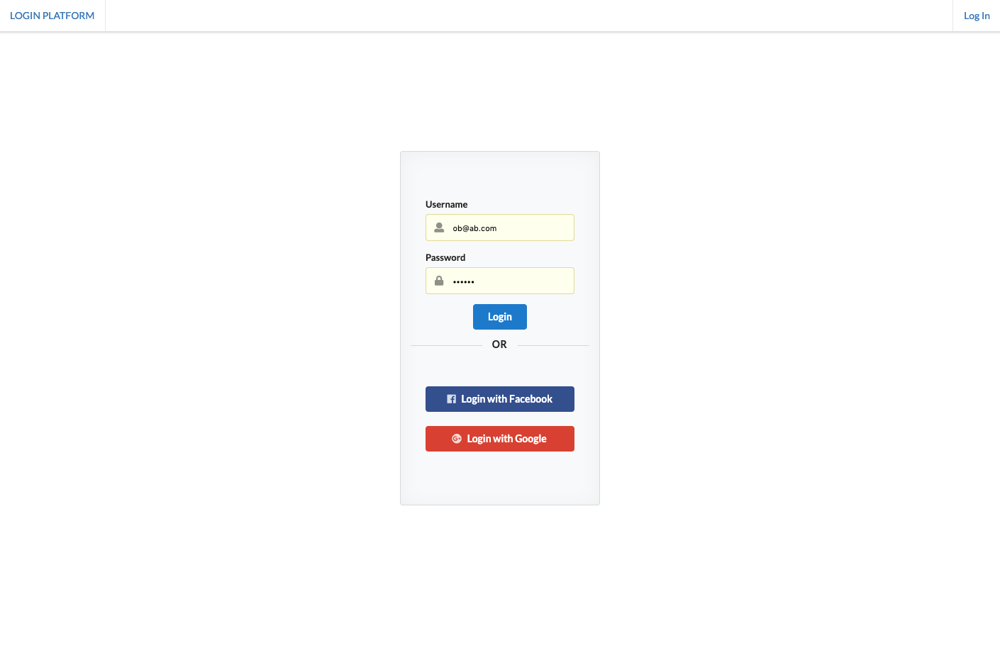
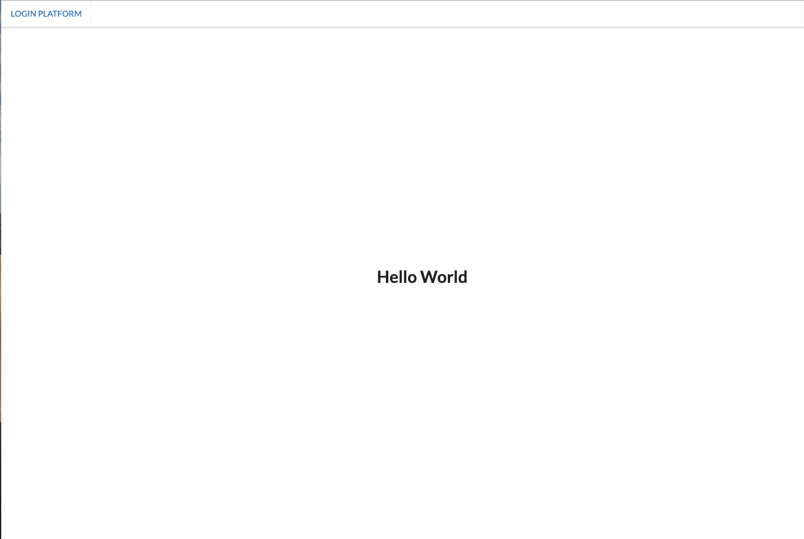

# Login Form (code base)
> App displays an full stack React implementation of a login form with both social and email & password login capabilities implemented using passportJS

## Example of Views

Initial page - with login form 


View once loggedIn 



## Functionality
* Ability to sign up and login with: 
 * Email and password combination
 * Facebook 
 * Google
* Login session managed with cookies


## Tools 

> Backend Tools
* ExpressJS
* PassportJS
* Cookie-Session
* BCrypt 
* Knex
* PostgreSQL

> Frontend Tools
* React 
* HTTP Proxy Middleware
* Semantic CSS
* Styled-Components


## Usage
NB: you have to run the frontend and backend server seperately - I was having problems using concurrently in production as the backend server would sometimes lag on reload/ not reload so I seperated the running of the servers.
```
//To Start the backend server 
cd loginForm 
cd backend && npm run server 

//also run the frontend server using 
cd loginForm 
cd frontend && npm run start

```
> NOTE : You would need to create a .env file in the backend with the following configurations for the backend to work:
```
FACEBOOK_APP_ID
FACEBOOK_APP_SECRET
GOOGLE_CLIENT_ID
GOOGLE_CLIENT_SECRET
```
> NOTE : You also need to create a postgress database with the config as detialed in the knexfile.js or create your own SQL database and edit the configuration.

## Todos
- [ ] Update error handling for uncaught cases
- [ ] implement user information/ profile data which is changable by the user (both on backend and frontend)
